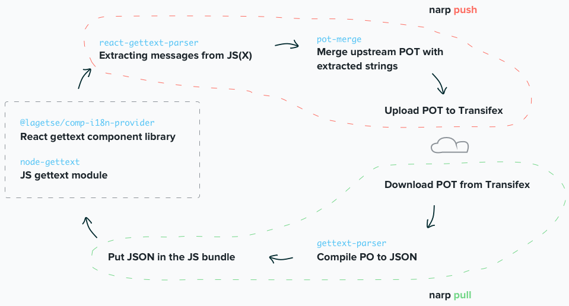

# narp

`narp` is a workflow utility to ease localization in JS(X) apps by automizing the following steps:

* Extraction of strings from source code ([react-gettext-parser](https://github.com/alexanderwallin/react-gettext-parser))
* Merging upstream and local translations in order to support translations in branches ([pot-merge](https://github.com/laget-se/pot-merge))
* Uploading POT resources to Transifex
* Download PO translations from Transifex
* Converting PO to JSON ([gettext-parser](https://github.com/andris9/gettext-parser))
* Writing the JSON translations to where you want it

For convenience, these tasks are grouped in two wrappers: `narp push` and `narp pull`.

* [#workflow]
* [#installation]
* [#usage]
* [#development]

## Workflow



## Installation

To use it easily, install narp globally with:

```sh
npm install -g narp
```

To use it in an automatization pipeline in your project, install it as a dev dependency:

```sh
npm install --save-dev narp
```

## Usage

### Using the CLI

```sh
# extract + merge pots + upload pot
node push
```

```sh
# download po's + convert to json + write to file
node pull
```

## Configuration in .narprc

`.narprc` is narp's configuration file. There you specify configs for the different tasks that require so.

You only need to specify the configs that you want to overwrite.

The defaults are:

```js
{
  "transifex": {
    "username": null,
    "password": null,
    "project": null,
    "resource": null,
    "sourceLang": "en"
  },
  "extract": {
    "componentPropsMap": { /* react-gettext-parser defaults */ },
    "funcArgumentsMap": { /* react-gettext-parser defaults */ }
  },
  "output": "messages.json"
}
```

## Development

### Creating builds

```sh
# Create a build from source
npm run build

# Build continuously as you save files
npm run build -- --watch
```

### Making it globally available while testing

```sh
cd path/to/narp && npm link
```

### Releases

Follow semver when bumping the version number, commit it and run

```sh
npm publish
```
